# Excel 基本操作和实用技巧集合

这里收录的是 Excel 基本操作以及常用的高效办公技巧。学会这些操作或技巧，Excel 办公常遇到的问题得以解决，办公效率也会大大提升。

## 基本数字格式

Excel 数字的格式，决定了数字如何显示和计算等。查看数字格式点击 `开始`，`数字`，选择任意分类即可：

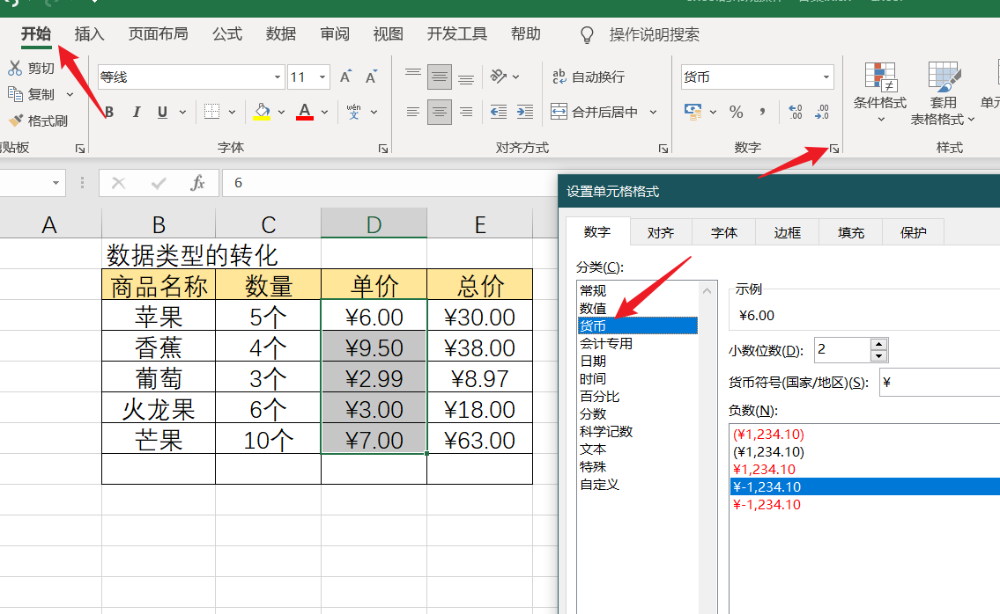

常用类别介绍：

- 文本格式：你输入什么他就显示什么，适合输入 0 开头的编号或非常大的编号等，例如 001，身份证号等。

- 数值格式：默认保留小数点后两位的数字，可以自行设置保留位数。

- 货币格式：可自由选择以什么货币显示，以及保留小数点后位数。

- 自定义格式：可以自由定义格式，例如数字 1201014 格式自定义输入格式 `0元`，结果就是 1201014元。

- 科学计数：输入的数字以科学计数法表示。

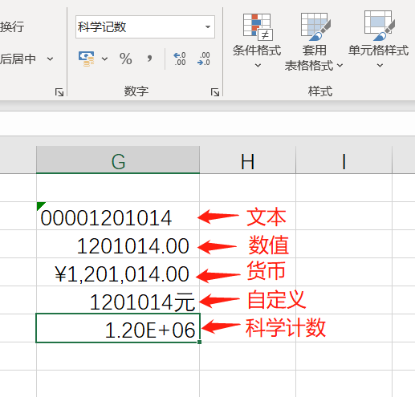

## 快速选中数据

要选中整列，点击列的字母编号；选中整行，点击行编号；选中整个表，点击行列编号交叉处。

`CTRL + Shift + 方向键` 可以快速选中行、列数据，或整块数据：

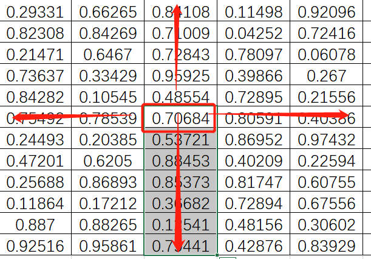

例如，按住 `CTRL + Shift` 不松手，先按向下键，再按向右键，则选中右下角整块数据：

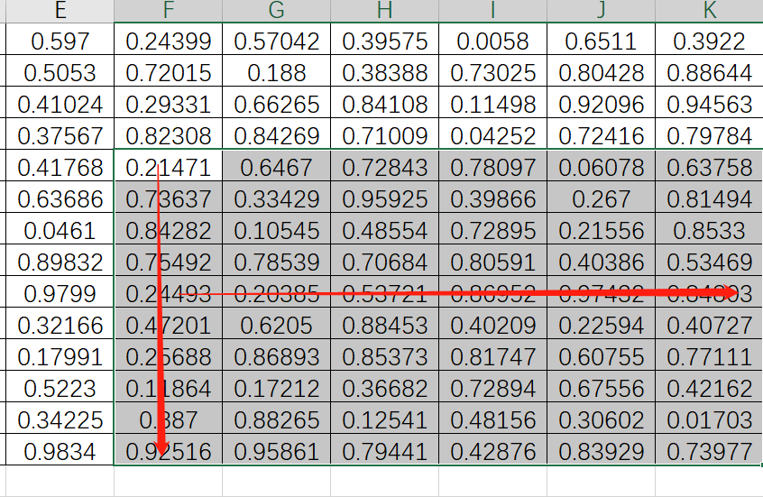

## 快速填充数字

以填充自然数为例，需要填充数据那一列最前面两行输入 1，2，选中它们，光标放在选中框右下角，出现一个小 + 号，双击鼠标，则自动填充整列数据：

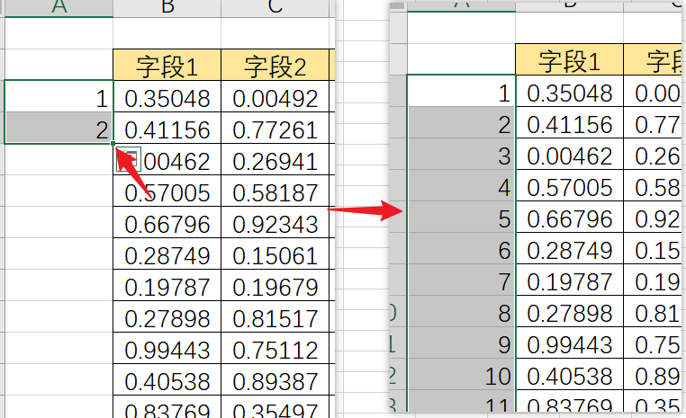

**提示**：输入一个数字，按上述操作，将整列填充该数字；也可以是其他数，例如奇数 1，3，5…… 或小数 0.5，1，1.5…… 等；填充日期，例如输入 2021/11/03，将自动日期升序填充。

## 快速求和

选中要求和的整行、或整列、或整块数据，按 `ALT` + `=`，就可以快速求和：

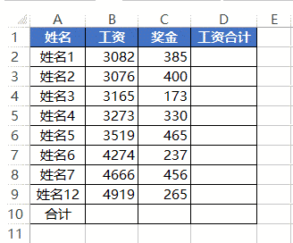

## 快速调整列宽

有时列宽过宽，或过窄数据显示不全，选中要调整的列，光标停留在选中列的右边界字母旁的线条上，双击，所有选中列自动调整到合适的宽度：

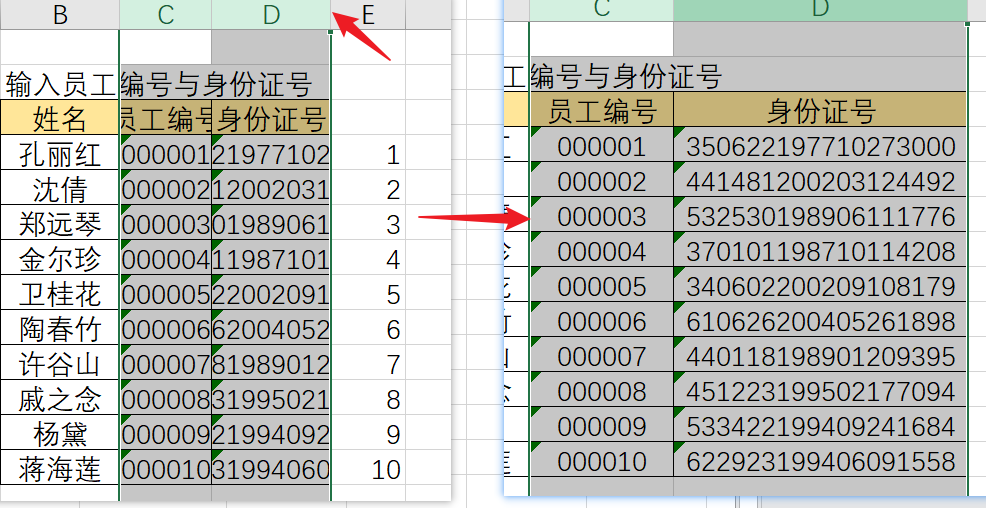

## 快速输入当天日期或时间

选择要填充的单元格，`CTRL` + `;`，自动填充当天日期；`CTRL` + `Shift` + `;`，自动填充当前时间。

## 快速输入相同内容

同一个表格不同单元格输入相同内容：按住 `CTRL` 不松手，选中要输入的单元格，松开手输入内容，再按 `CTRL + Enter`：

不同表格的同一个位置输入相同内容：按住 `Shift` 不松手，选择要输入的表格，松开手选择要输入的单元格，输入内容按 `Enter`，将在所有选择表格的同一个位置输入相同内容：

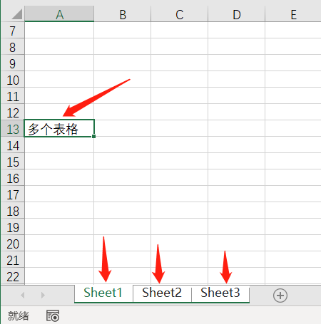

## 快速填充不同内容

有一批身份证号如何快速提取生日？第一个生日单元格输入生日，按 `Enter`，再按 `CTRL + E`：

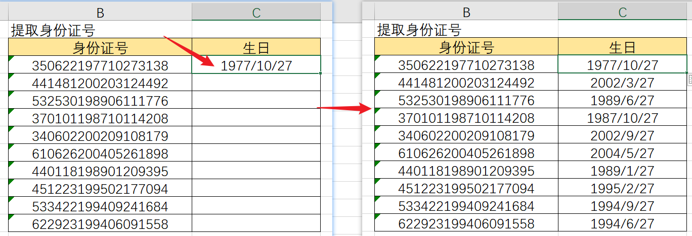

同样的方法可以填充各种类型的数据，例如省与县市提取，名字与编号提取等。

## 填充合并单元格

有时需要将合并的单元格拆分，同时要填充拆分后的空值，怎么操作？

选中合并的单元格，点击取消合并，`CTRL + G` 打开定位，选择 `条件定位`，勾选 `空值`，确定：

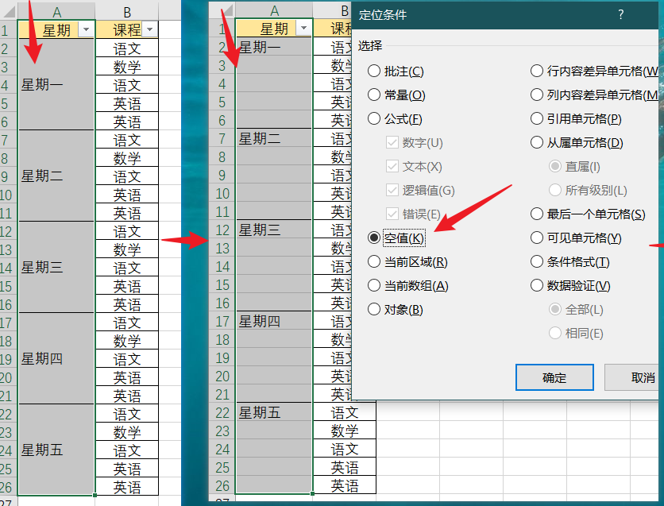

输入 `=` 号，选中输入 `=` 号单元格的上一个单元格，按 `CTRL + Enter`：

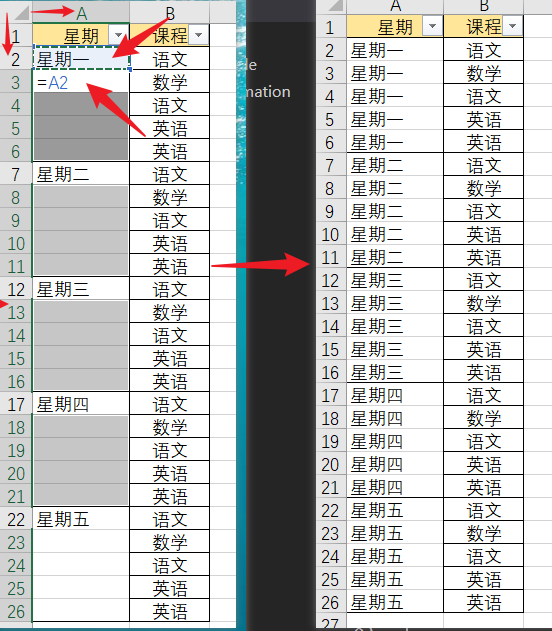

## 单元格内换行

同一个单元格内，需要换行输入怎么办？`Alt + Enter`：

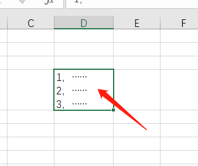

## 固定标题行

将数据内容向下滚的时候，想要标题行始终都在，怎么操作？点击 `视图`，`冻结窗格`，`冻结首行`：

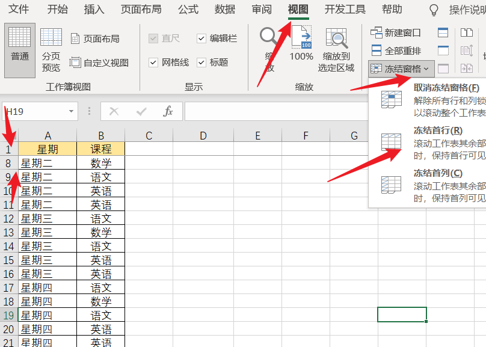

## 打印时每一页都有标题

点击 `页面布局`，`打印标题`，顶端标题行中选择要作为标题的行（下面示例是第一行）：

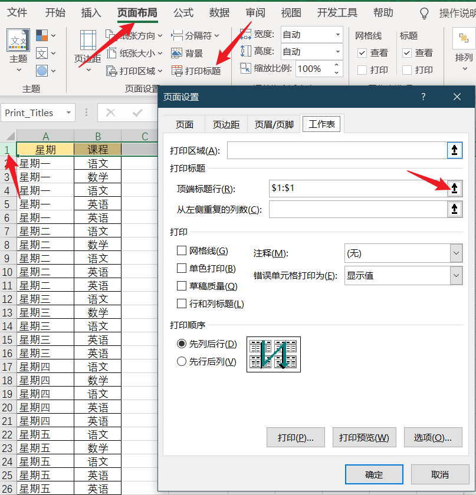

## 快速标出目标数据

一个成绩表，快速标出不及格的科目怎么操作呢？点击 `开始`，`条件格式`，`突出显示单元格规则`，`小于`，输入 60，点确定：

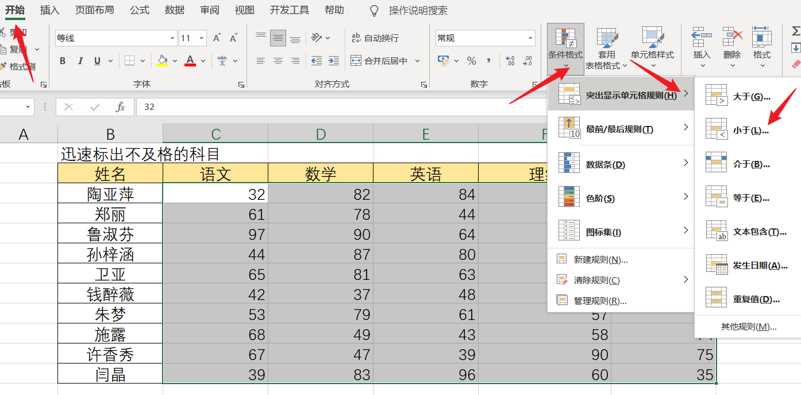

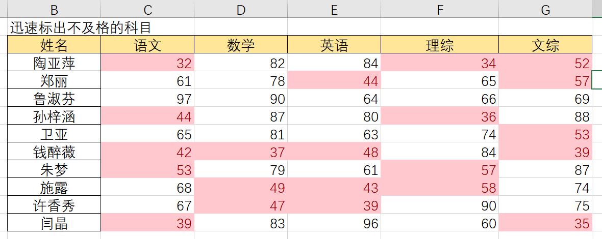

该操作可以用来标出重复值等。

## 选择性粘贴

复制、粘贴表格的时候，有许多粘贴选项可以根据需求选择：

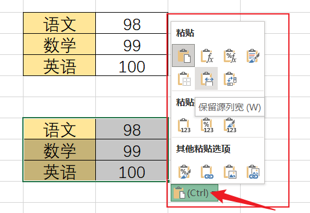

例如将数据转置：

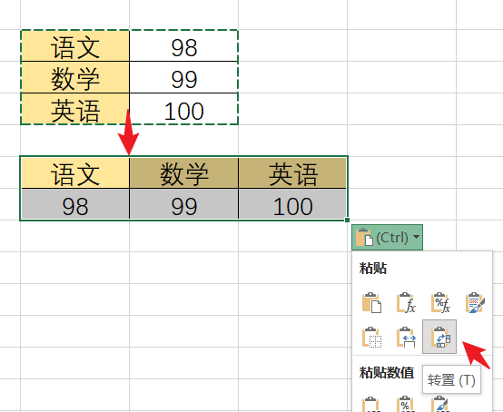

或者将数据缩放一定倍数。复制倍数，选中要缩放的数据，单击右键，选择性粘贴，对话框选择 `乘`，确定：

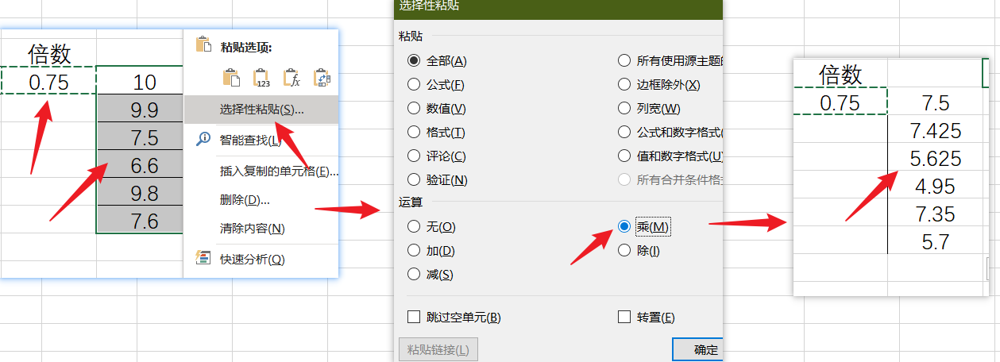

## 数据验证

如果评价只能输入 优、良、中、差，怎么设置？选中要输入评价的单元格，点击 `数据`，`数据验证`，选择 `数据验证`，验证条件选择 `序列`，来源输入 `优,良,中,差`，确定，即可实现评价只能输入优、良、中、差：

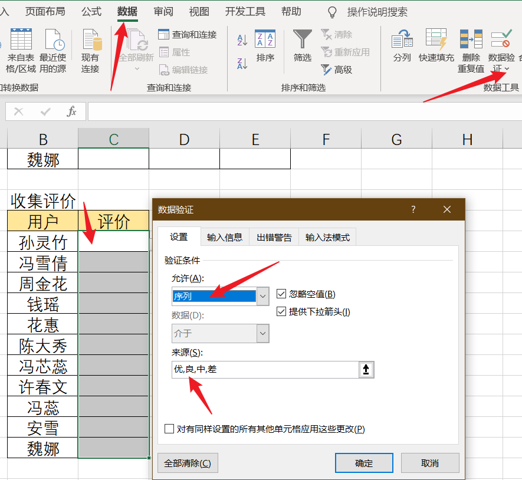

同样的操作，还可以实现例如只能输入某个范围内的数字等，灵活选择和设置即可。

## 快速插入多行

选取要在其下插入行的那一行，按住 `Shift` 键不送，光标停留在行号右下角会变样，变样后按住鼠标左键向下拉，要插入多少行就插入多少行：

## 移动列的位置

以下图为例，选取 D 列，光标放在边线处，按 `Shift` 同时按下鼠标左键不松，拖动到 B 列前面，松开即可：

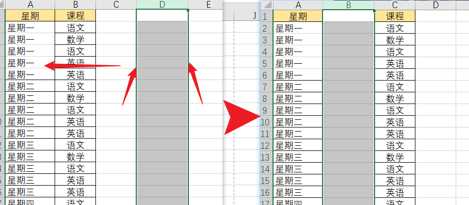

## 工作表保护和管理

如果想要给工作表添加密码或权限，点击 `文件`，`信息`，`保护工作簿`，然后按需求设置；要恢复之前自动保存的信息，`信息` 下面 `管理工作簿` 中选择恢复；如果要设置自动保存信息，防止意外关闭输入的信息丢失，点击 `选项`，`保存`，设置自动保存时间间隔：

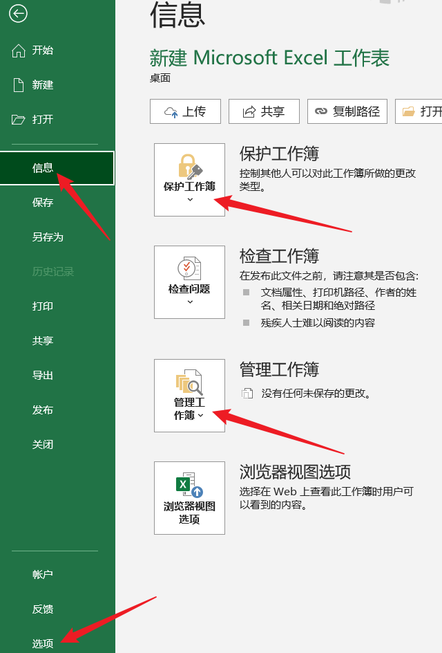

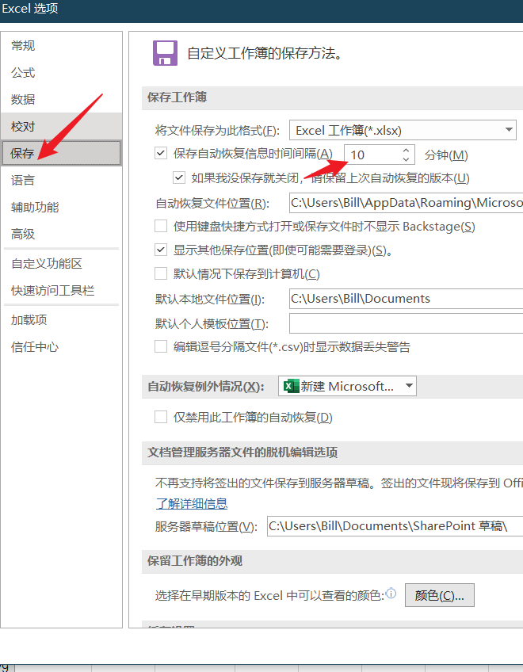

## 按需要筛选数据

要筛选出 20 岁以下的男生，怎么操作？选中标题列，点击 `开始`，`排序和筛选`，`筛选`：

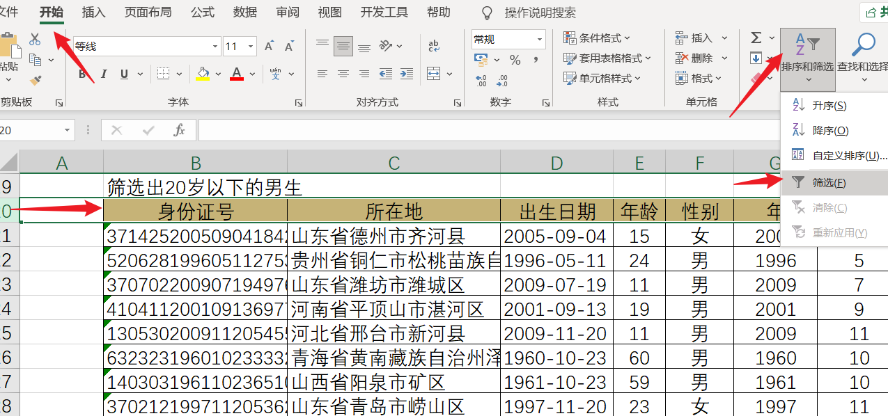

上述操作后，标题列就出现了筛选按钮，筛选年龄，就点击年龄列按钮，点击 `数字筛选`，`小于或等于`，输入数字，确定即可：

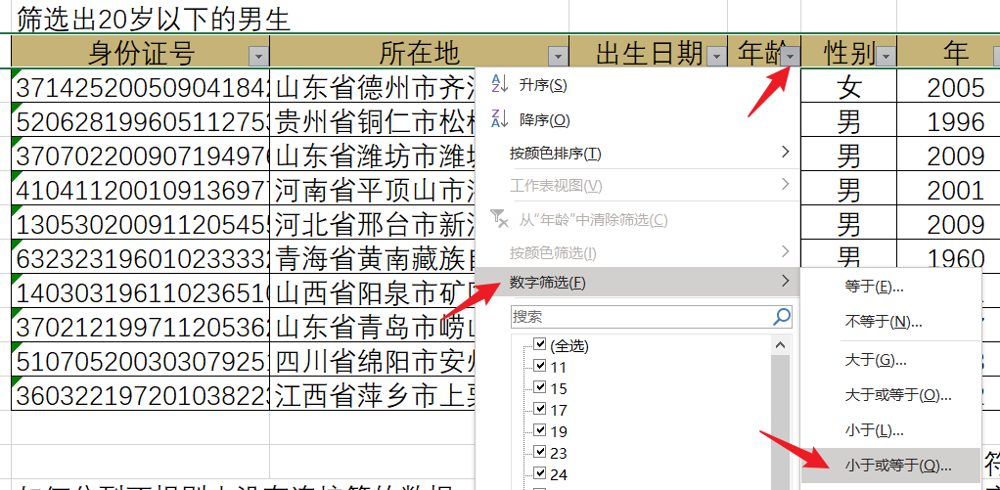

类似操作筛选男生即可。

## 隐藏和取消隐藏

要将某些行或列隐藏，选中要隐藏的行或列，单击右键选择 `隐藏`：

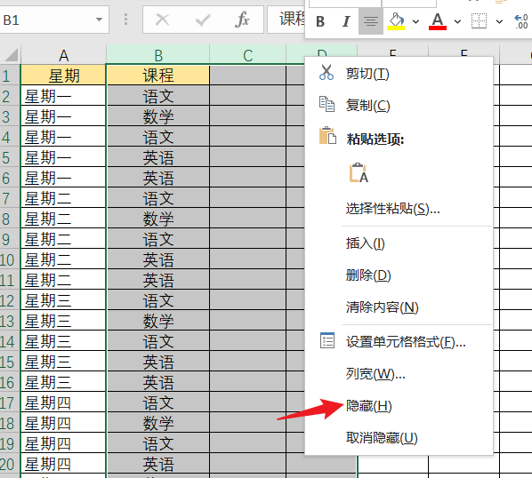

要取消隐藏，选中被隐藏列两边两列，单击右键选择 `取消隐藏`：

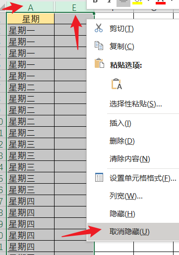

## 附录：Excel 快捷键

许多用户发现将外部键盘与 Excel 的键盘快捷方式结合使用可提高他们的工作效率。 对于行动不便或者有视力障碍的用户，键盘快捷方式比触摸屏更方便，是使用鼠标的重要替代方式。 

注意: 

- 本主题中的这些快捷方式指的是美式键盘布局。 其他键盘布局的键可能与美式键盘上的键不完全对应。

- 快捷方式中的加号 (+) 表示需要同时按多个键。

- 快捷方式中的逗号 (,) 表示需要按顺序按多个键。

功能区快捷键，按 `Alt` 将在功能区显示所有功能区相应的快捷键。

### 常用快捷方式

此表列出了 Excel 中最常用的快捷方式。

| 执行的操作       | 按          |
| --------------------- | ------------ |
| 关闭工作簿       | Ctrl+W       |
| 打开工作簿       | Ctrl+O       |
| 转至“主页”选项卡 | Alt+H        |
| 保存工作簿       | Ctrl+S       |
| 复制                | Ctrl+C       |
| 粘贴                | Ctrl+V       |
| 撤消                | Ctrl+Z       |
| 删除单元格内容 | 删除       |
| 选择填充颜色    | Alt+H, H     |
| 剪切                | Ctrl+X       |
| 转至“插入”选项卡 | Alt+N        |
| 加粗                | Ctrl+B       |
| 居中对齐单元格内容 | Alt+H, A, C  |
| 转至“页面布局 ”选项卡 | Alt+P        |
| 转至“数据”选项卡 | Alt+A        |
| 转至“视图”选项卡 | Alt+W        |
| 打开上下文菜单 | Shift+F10 或 上下文键 |
| 添加边框          | Alt+H, B     |
| 删除列             | Alt+H, D, C  |
| 转至“公式”选项卡 | Alt+M        |
| 隐藏选定的行    | Ctrl+9       |
| 隐藏选定的列    | Ctrl+0       |

### 用于单元格导航的键盘快捷方式

| 若要                                                                                                                                | 按                                                  |
| ------------------------------------------------------------------------------------------------------------------------------------- | ---------------------------------------------------- |
| 移到工作表中的前一个单元格或对话框中的前一个选项。                                                           | Shift+Tab                                            |
| 在工作表中向上移动一个单元格。                                                                                         | 向上键                                            |
| 在工作表中向下移动一个单元格。                                                                                         | 向下键                                            |
| 在工作表中向左移动一个单元格。                                                                                         | 向左键                                            |
| 在工作表中向右移动一个单元格。                                                                                         | 向右键                                            |
| 移到工作表中当前数据区域的边缘。                                                                                      | Ctrl+箭头键                                       |
| 进入“结束”模式，移到与活动单元格相同列或行中的下一个非空单元格，然后关闭“结束”模式。 如果单元格为空，则移到行或列中的最后一个单元格。 | End、箭头键                                      |
| 移到工作表上的最后一个单元格，即所使用的最右一列的最下面一行。                                         | Ctrl+End                                             |
| 将单元格选定区域扩展至工作表上最后一个使用的单元格（右下角）。                                         | Ctrl+Shift+End                                       |
| 当 Scroll Lock 处于开启状态时，移到窗口左上角的单元格。                                                          | Home+Scroll Lock                                     |
| 移到工作表的开头。                                                                                                           | Ctrl+Home                                            |
| 在工作表中向下移动一屏。                                                                                                  | Page Down                                            |
| 移到工作簿中的下一个工作表。                                                                                            | Ctrl+Page Down                                       |
| 在工作表中向右移动一屏。                                                                                                  | Alt+Page Down                                        |
| 在工作表中向上移动一屏。                                                                                                  | Page Up                                              |
| 在工作表中向左移动一屏。                                                                                                  | Alt+Page Up                                          |
| 移到工作簿中的上一个工作表。                                                                                            | Ctrl+Page Up                                         |
| 在工作表中向右移动一个单元格。 或者，在受保护的工作表中，在未锁定的单元格之间移动。          | Tab 键                                              |
| 对应用了数据验证选项的单元格打开验证选项列表。                                                                 | Alt+向下键                                        |
| 环绕文本框或图像等浮动形状。                                                                                            | 按 Ctrl+Alt+5，然后反复按 Tab 键             |
| 退出浮动形状导航并返回普通导航。                                                                                      | Esc                                                  |
| 水平滚动。                                                                                                                       | Ctrl+Shift，然后向上滚动鼠标滚轮向左、向下滚动以向右 |
| 放大。                                                                                                                             | CTRL+ALT+=                                           |
| 缩小。                                                                                                                             | CTRL+ALT+-                                           |

### 用于单元格格式设置的键盘快捷方式

| 若要                                                                                                                                                               | 按                          |
| -------------------------------------------------------------------------------------------------------------------------------------------------------------------- | ---------------------------- |
| 打开“设置单元格格式”对话框。                                                                                                                        | Ctrl+1                       |
| 在“设置单元格格式”对话框中设置字体格式。                                                                                                      | Ctrl+Shift+F 或 Ctrl+Shift+P |
| 编辑活动单元格，并将插入点放在其内容的末尾。 或者，如果单元格的编辑已关闭，则将插入点移到编辑栏中。 如果编辑公式，请关闭或打开点模式，以便你可以使用箭头键创建引用。 | F2                           |
| 插入备注                                                                                                                                                         | Shift+F2                     |
|                                                                                                                                                                      |                              |
| 打开和编辑单元格备注                                                                                                                                       | Shift+F2                     |
| 插入线程式批注                                                                                                                                                | Ctrl+Shift+F2                |
|                                                                                                                                                                      |                              |
| 打开和答复线程线程批注                                                                                                                                    | Ctrl+Shift+F2                |
| 打开用于插入空白单元格的“插入”对话框。                                                                                                         | Ctrl+Shift+加号 (+)        |
| 打开用于删除选定单元格的“删除”对话框。                                                                                                         | Ctrl+减号 (-)              |
| 输入当前时间。                                                                                                                                                | Ctrl+Shift+冒号 (:)        |
| 输入当前日期。                                                                                                                                                | Ctrl+分号 (;)              |
| 在工作表中，在显示单元格值或公式之间切换。                                                                                                      | Ctrl+重音符 (`)           |
| 将公式从活动单元格上方的单元格复制到单元格或编辑栏中。                                                                                    | Ctrl+撇号 (')              |
| 移动选定的单元格。                                                                                                                                          | Ctrl+X                       |
| 复制选定的单元格。                                                                                                                                          | Ctrl+C                       |
| 在插入点粘贴内容，并替换任何所选内容。                                                                                                            | Ctrl+V                       |
| 打开“选择性粘贴”对话框。                                                                                                                              | Ctrl+Alt+V                   |
| 将文本设置为斜体或删除倾斜格式。                                                                                                                     | Ctrl+I 或 Ctrl+3            |
| 将文本设置为加粗或删除加粗格式。                                                                                                                     | Ctrl+B 或 Ctrl+2            |
| 为文字添加下划线或删除下划线。                                                                                                                        | Ctrl+U 或 Ctrl+4            |
| 应用或删除删除线格式。                                                                                                                                    | Ctrl+5                       |
| 在隐藏对象、显示对象和显示对象的占位符之间切换。                                                                                             | Ctrl+6                       |
| 将轮廓边框应用于选定单元格。                                                                                                                           | Ctrl+Shift+与号 (&)        |
| 从选定单元格中删除轮廓边框。                                                                                                                           | Ctrl+Shift+下划线 (_)     |
| 显示或隐藏大纲符号。                                                                                                                                       | Ctrl+8                       |
| 使用“向下填充”命令将选定范围内最顶层单元格的内容和格式复制到下面的单元格中。                                                | Ctrl+D                       |
| 应用“常规”数字格式。                                                                                                                                    | Ctrl+Shift+波形符(~)      |
| 应用带有两位小数的“货币”格式（负数放在括号中）。                                                                                          | Ctrl+Shift+美元符号 ($)  |
| 应用不带小数位的“百分比”格式。                                                                                                                     | Ctrl+Shift+百分比(%)      |
| 应用带有两位小数的科学计数格式。                                                                                                                     | Ctrl+Shift+脱字号(^)      |
| 应用带有日、月和年的“日期”格式。                                                                                                                  | Ctrl+Shift+数字符号 (#)  |
| 应用带有小时和分钟以及 AM 或 PM 的“时间”格式。                                                                                                 | Ctrl+Shift+@ 符号 (@)      |
| 应用带有两位小数、千分位分隔符和减号 (-)（用于负值）的“数值”格式。                                                                 | Ctrl+Shift+感叹号 (!)     |
| 打开“插入超链接”对话框                                                                                                                                 | Ctrl+K                       |
| 检查活动工作表或选定范围中的拼写。                                                                                                                  | F7                           |
| 显示用于包含数据的选定单元格的“快速分析”选项。                                                                                             | Ctrl+Q                       |
| 显示“创建表”对话框。                                                                                                                                    | Ctrl+L 或 Ctrl+T            |
| 打开“工作簿统计信息”对话框。                                                                                                                        | Ctrl+Shift+G                 |

### 进行选择并执行操作的键盘快捷方式

| 若要                                                                                                                   | 按                                               |
| ------------------------------------------------------------------------------------------------------------------------ | ------------------------------------------------- |
| 选择整个工作表。                                                                                                 | Ctrl+A 或 Ctrl+Shift+空格键                   |
| 选择工作簿中的当前和下一个工作表。                                                                      | Ctrl+Shift+Page Down                              |
| 选择工作簿中的当前和上一个工作表。                                                                      | Ctrl+Shift+Page Up                                |
| 将单元格的选定范围扩大一个单元格。                                                                      | Shift+箭头键                                   |
| 将单元格的选定范围扩展到活动单元格所在列或行中的最后一个非空单元格，或者如果下一个单元格为空，则扩展到下一个非空单元格。 | Ctrl+Shift+箭头键                              |
| 打开扩展模式并使用箭头键扩展选定范围。 再次按下以关闭。                                       | F8                                                |
| 通过使用箭头键将非邻近单元格或区域添加到单元格的选定范围中。                               | Shift+F8                                          |
| 在同一单元格中另起一个新行。                                                                               | Alt+Enter                                         |
| 使用当前输入填充选定的单元格区域。                                                                      | Ctrl+Enter                                        |
| 完成单元格输入并选择上面的单元格。                                                                      | Shift+Enter                                       |
| 选择工作表中的整列。                                                                                           | Ctrl+空格键                                    |
| 选择工作表中的整行。                                                                                           | Shift+空格键                                   |
| 当某个对象处于选定状态时，选择工作表上的所有对象。                                              | Ctrl+Shift+空格键                              |
| 将单元格的选定范围扩展到工作表的开头。                                                                | Ctrl+Shift+Home                                   |
| 如果工作表包含数据，则选择当前区域。 再按一次将选择当前区域和其摘要行。 按第三次可选择整个工作表。 | Ctrl+A 或 Ctrl+Shift+空格键                   |
| 选择活动单元格周围的当前区域。                                                                            | Ctrl+Shift+星号 (*)                             |
| 当菜单或子菜单处于可见状态时，选择菜单上的第一个命令。                                        | Home                                              |
| 重复上一个命令或操作（如有可能）。                                                                      | Ctrl+Y                                            |
| 撤消最后一个操作。                                                                                              | Ctrl+Z                                            |
| 展开分组的行或列。                                                                                              | 鼠标悬停在折叠的项目上时，按住 Shift 并向下滚动。 |
| 折叠分组的行或列。                                                                                              | 鼠标悬停在展开的项目上时，按住 Shift 并向上滚动。 |

### 用于处理数据、函数和编辑栏的键盘快捷方式

| 若要                                                                                                                                                               | 按                     |
| -------------------------------------------------------------------------------------------------------------------------------------------------------------------- | ----------------------- |
| 编辑活动单元格，并将插入点放在其内容的末尾。 或者，如果单元格的编辑已关闭，则将插入点移到编辑栏中。 如果编辑公式，请关闭或打开点模式，以便你可以使用箭头键创建引用。 | F2                      |
| 展开或折叠编辑栏。                                                                                                                                          | Ctrl+Shift+U            |
| 取消单元格或编辑栏中的输入。                                                                                                                           | Esc                     |
| 完成编辑栏中的输入并选择下面的单元格。                                                                                                            | Enter                   |
| 在编辑栏中时，将光标移到文本的末尾。                                                                                                               | Ctrl+End                |
| 选择编辑栏中从光标所在的位置到结尾的所有文本。                                                                                                | Ctrl+Shift+End          |
| 计算所有打开的工作簿中的所有工作表。                                                                                                               | F9                      |
| 计算活动工作表。                                                                                                                                             | Shift+F9                |
| 计算所有打开的工作簿中的所有工作表，不管自上次计算以来它们是否已更改。                                                            | Ctrl+Alt+F9             |
| 检查从属的公式，然后计算所有打开的工作簿中的所有单元格，其中包括未标记为需要计算的单元格。                              | Ctrl+Alt+Shift+F9       |
| 显示“错误检查”按钮的菜单或消息。                                                                                                                  | Alt+Shift+F10           |
| 当插入点位于公式中某个函数名称的右边时，会显示“函数参数”对话框。                                                                  | Ctrl+A                  |
| 当插入点位于公式中某个函数名称的右边时，会插入参数名称和括号。                                                                        | Ctrl+Shift+A            |
| 插入自动求和公式                                                                                                                                             | Alt+=                   |
| 调用快速填充以自动识别相邻列中的模式并填充当前列                                                                                             | Ctrl+E                  |
| 如果选定了单元格引用或范围，则会在公式中的绝对和相对引用的所有各种组合之间循环切换。                                       | F4                      |
| 插入函数。                                                                                                                                                      | Shift+F3                |
| 将活动单元格上方的单元格的值复制到单元格或编辑栏中。                                                                                       | Ctrl+Shift+直双引号 (") |
| 在当前范围中创建数据的嵌入图表。                                                                                                                     | Alt+F1                  |
| 在单独的图表工作表中创建当前范围内数据的图表。                                                                                                | F11                     |
| 定义名称以在引用中使用。                                                                                                                                 | Alt+M, M, D             |
| 从“粘贴名称”对话框中粘贴名称（在工作簿中已定义名称的情况下）。                                                                     | F3                      |
| 移到数据表单下一条记录中的第一个字段。                                                                                                            | Enter                   |
| 创建、运行、编辑或删除宏。                                                                                                                              | Alt+F8                  |
| 打开 Microsoft Visual Basic For Applications Editor。                                                                                                             | Alt+F11                 |

### 刷新外部数据的键盘快捷方式

使用以下键刷新来自外部数据源的数据。

| 执行的操作        | 按         |
| ---------------------- | ----------- |
| 停止刷新操作     | Esc         |
| 刷新当前工作表中的数据 | Ctrl+F5     |
| 刷新工作簿中的所有数据 | Ctrl+Alt+F5 |

### 功能键

F1	

- F1（单独使用）：显示“Excel 帮助”任务窗格。
	
- Ctrl+F1：显示或隐藏功能区。
	
- Alt+F1：在当前区域中创建数据的嵌入图表。
	
- Alt+Shift+F1：插入新的工作表。
	
F2	

- F（单独使用）2：编辑活动单元格，并将插入点放在其内容的末尾。 或者，如果单元格的编辑已关闭，则将插入点移到编辑栏中。 如果编辑公式，请关闭或打开点模式，以便你可以使用箭头键创建引用。
	
- Shift+F2：添加或编辑单元格备注。
	
- Ctrl+F2：显示 Backstage 视图 中“打印”选项卡上的打印预览区域。
	
F3	

- F3（单独使用）：显示“粘贴名称”对话框。 仅适用于在工作簿中已定义名称的情况。
	
- 按 Shift+F3：可显示“插入函数”对话框。
	
F4	

- F4（单独使用）：重复上一个命令或操作（如有可能）。
	
- 当公式中选定单元格引用或区域时，按 F4 可在绝对和相对引用的所有各种组合中循环切换。
	
- Ctrl+F4：关闭选定的工作簿窗口。
	
- Alt+F4：关闭 Excel。
	
F5	

- F5（单独使用）：显示“定位”对话框。
	
- Ctrl+F5：恢复选定工作簿窗口的窗口大小。
	
F6	

- F6（单独使用）：在工作表、功能区、任务窗格和缩放控件之间切换。 在已拆分的工作表中，在窗格和功能区区域之间切换时，按 F6 可包括已拆分的窗格。
	
- Shift+F6：在工作表、缩放控件、任务窗格和功能区之间切换。
	
- Ctrl+F6：在 2 个 Excel 窗口间切换。
	
- Ctrl+Shift+F6：在所有 Excel 窗口之间切换。
	
F7	

- F7（单独使用）：打开“拼写检查”对话框，用于检查活动工作表或选定范围中的拼写。
	
- Ctrl+F7：如果工作簿窗口未最大化，则按 Ctrl+F7 可对该窗口执行“移动”命令。 使用箭头键移动窗口，并在完成时按 Enter，或按 Esc 取消。
	
F8	

- F8（单独使用）：打开或关闭扩展模式。 在扩展模式中，“扩展选定”将出现在状态行中，并且按箭头键可扩展选定范围。
	
- Shift+F8：可以使用箭头键将非邻近单元格或区域添加到单元格的选定范围中。
	
- Ctrl+F8：当工作簿未最大化时，执行“大小”命令。
	
- Alt+F8：显示“宏”对话框，用于创建、运行、编辑或删除宏。
	
F9	

- F9（单独使用）：计算所有打开的工作簿中的所有工作表。
	
- Shift+F9：计算活动工作表。
	
- Ctrl+Alt+F9：计算所有打开的工作簿中的所有工作表，不管它们自上次计算以来是否已更改。
	
- Ctrl+Alt+Shift+F9：重新检查从属的公式，然后计算所有打开的工作簿中的所有单元格，其中包括未标记为需要计算的单元格。
	
- Ctrl+F9：将工作簿窗口最小化为图标。
	
F10	

- F10（单独使用）：打开或关闭快捷键提示。 （按 Alt 也能实现相同的操作。）
	
- Shift+F10：显示选定项目的快捷菜单。
	
- Alt+Shift+F10：显示“错误检查”按钮的菜单或消息。
	
- Ctrl+F10：最大化或还原选定的工作簿窗口。
	
F11	

- F11（单独使用）：在单独的图表工作表中创建当前范围内数据的图表。
	
- Shift+F11：插入一个新工作表。
	
- Alt+F11：打开 Microsoft Visual Basic For Applications 编辑器，你可以在该编辑器中通过使用 Visual Basic for Applications (VBA) 来创建宏。
	
F12	

- F12（单独使用）：显示“另存为”对话框。
	
### 其他有用的快捷键

- Alt

在功能区上显示“快捷键提示”（新快捷方式）。

例如，

Alt、W，P 可将工作表切换到“页面视图”。

Alt、W，L 可将工作表切换到“普通视图”。

Alt、W、I 可将工作表切换到“分页预览”视图。

- 箭头键

在工作表中上移、下移、左移或右移一个单元格。

按 Ctrl+箭头键可移动到工作表中当前数据区域的边缘。

按 Shift+箭头键可将单元格的选定范围扩大一个单元格。

按 Ctrl+Shift+箭头键可将单元格的选定范围扩展到活动单元格所在列或行中的最后一个非空单元格，或者如果下一个单元格为空，则将选定范围扩展到下一个非空单元格。

当功能区处于选中状态时，按向左键或向右键可选择左边或右边的选项卡。 子菜单处于打开或选中状态时，按这些箭头键可在主菜单和子菜单之间切换。 当功能区选项卡处于选中状态时，按这些键可导航选项卡按钮。

当菜单或子菜单处于打开状态时，按向下键或向上键可选择下一个或上一个命令。 当功能区选项卡处于选中状态时，按这些键可向上或向下导航选项卡组。

在对话框中，按箭头键可在打开的下拉列表中的各个选项之间移动，或在一组选项的各个选项之间移动。

按向下键或 Alt+向下键可打开选定的下拉列表。

- Backspace

在编辑栏中删除左边的一个字符。

也可清除活动单元格的内容。

在单元格编辑模式下，按该键将会删除插入点左边的字符。

- 删除（Delete）

从选定单元格中删除单元格内容（数据和公式），而不影响单元格格式、线程批注或注释。

在单元格编辑模式下，按该键将会删除插入点右边的字符。

- End

按 End 可开启或关闭结束模式。 在结束模式下，可按箭头键以移动到与活动单元格相同列或行中的下一个非空单元格。 按箭头键后，将自动关闭结束模式。 请确保下一次按箭头键前先再次按 End。 结束模式开启时，状态栏中会显示。

如果单元格均为空，则按 End 后再按箭头键将移动到该行或列中的最后一个单元格。

当菜单或子菜单处于可见状态时，End 也可选择菜单上的最后一个命令。

按 Ctrl+End 可移到工作表上的最后一个单元格，即所使用的最右一列的最下面一行。 如果光标位于编辑栏中，按 Ctrl + End 可将光标移至文本的末尾。

按 Ctrl+Shift+End 可将单元格选定区域扩展到工作表上所使用的最后一个单元格（位于右下角）。 如果光标位于编辑栏中，按 Ctrl+Shift+End 可选择编辑栏中从光标所在位置到末尾处的所有文本，这不会影响编辑栏的高度。

- Enter

从单元格或编辑栏中完成单元格输入，并（默认）选择下面的单元格。

在数据表单中，按该键可移动到下一条记录中的第一个字段。

打开选定的菜单（按 F10 激活菜单栏），或执行选定命令的操作。

在对话框中，按该键可执行对话框中默认命令按钮（带有突出轮廓的按钮，通常为“确定”按钮）的操作。

按 Alt+Enter 可在同一单元格中另起一个新行。

按 Ctrl+Enter 可使用当前条目填充选定的单元格区域。

按 Shift+Enter 可完成单元格输入并选择上面的单元格。

- Esc

取消单元格或编辑栏中的输入。

关闭打开的菜单或子菜单、对话框或消息窗口。

在应用全屏模式时，按该键还可以关闭此模式，返回到普通屏幕模式，再次显示功能区和状态栏。

- Home

移到工作表中某一行的开头。

当 Scroll Lock 处于开启状态时，移到窗口左上角的单元格。

当菜单或子菜单处于可见状态时，选择菜单上的第一个命令。

按 Ctrl+Home 可移到工作表的开头。

按 Ctrl+Shift+Home 可将单元格的选定范围扩展到工作表的开头。

- Page Down

在工作表中下移一个屏幕。

按 Alt+Page Down 可在工作表中向右移动一个屏幕。

按 Ctrl+Page Down 可移到工作簿中的下一个工作表。

按 Ctrl+Shift+Page Down 可选择工作簿中的当前和下一个工作表。

- Page Up

在工作表中上移一个屏幕。

按 Alt+Page Up 可在工作表中向左移动一个屏幕。

按 Ctrl+Page Up 可移到工作簿中的上一个工作表。

按 Ctrl+Shift+Page Up 可选择工作簿中的当前和上一个工作表。

- Shift

按住 Shift 键的同时拖动选定的行、列或选定单元格，移动所选单元格并拖放以将其插入新位置。

- 空格键

在对话框中，执行选定按钮的操作，或者选中或清除复选框。

按 Ctrl+空格键可选择工作表中的整列。

按 Shift+空格键可选择工作表中的整行。

按 Ctrl+Shift+空格键可选择整个工作表。

如果工作表包含数据，按 Ctrl+Shift+空格键可选择当前区域。 再次按 Ctrl+Shift+空格键可选择当前区域和其摘要行。 第三次按 Ctrl+Shift+空格键可选择整个工作表。

当某个对象处于选定状态时，按 Ctrl+Shift+空格键可选择工作表上的所有对象。

按 Alt+空格键可显示 Excel 窗口的“控件”菜单。

- Tab 键

在工作表中向右移动一个单元格。

在受保护的工作表中，可在未锁定的单元格之间移动。

在对话框中，移到下一个选项或选项组。

按 Shift+Tab 可在工作表中移至前一个单元格，或在对话框中移至前一个选项。

按 Ctrl+Tab 可切换到对话框中的下一个选项卡，或（如果未打开对话框）在 2 个 Excel 窗口间切换。 

按 Ctrl+Shift+Tab 可切换到对话框中的上一个选项卡，或（如果未打开对话框）在所有 Excel 窗口间切换。